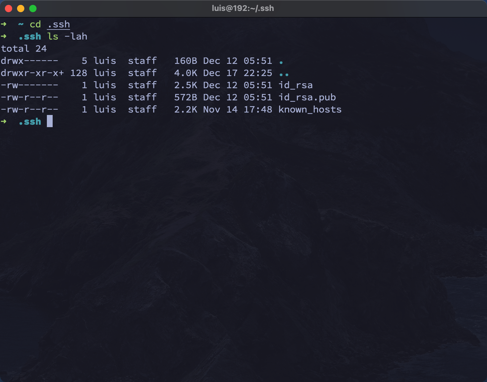
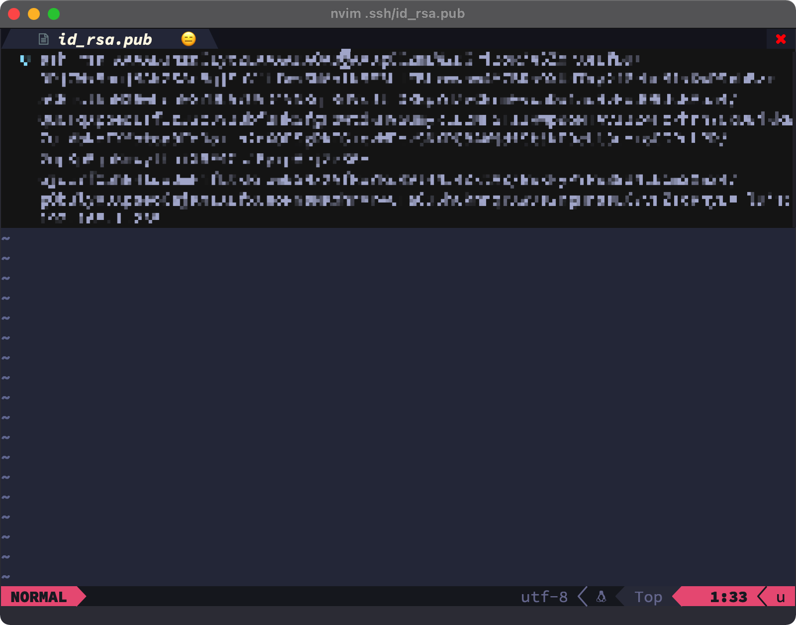
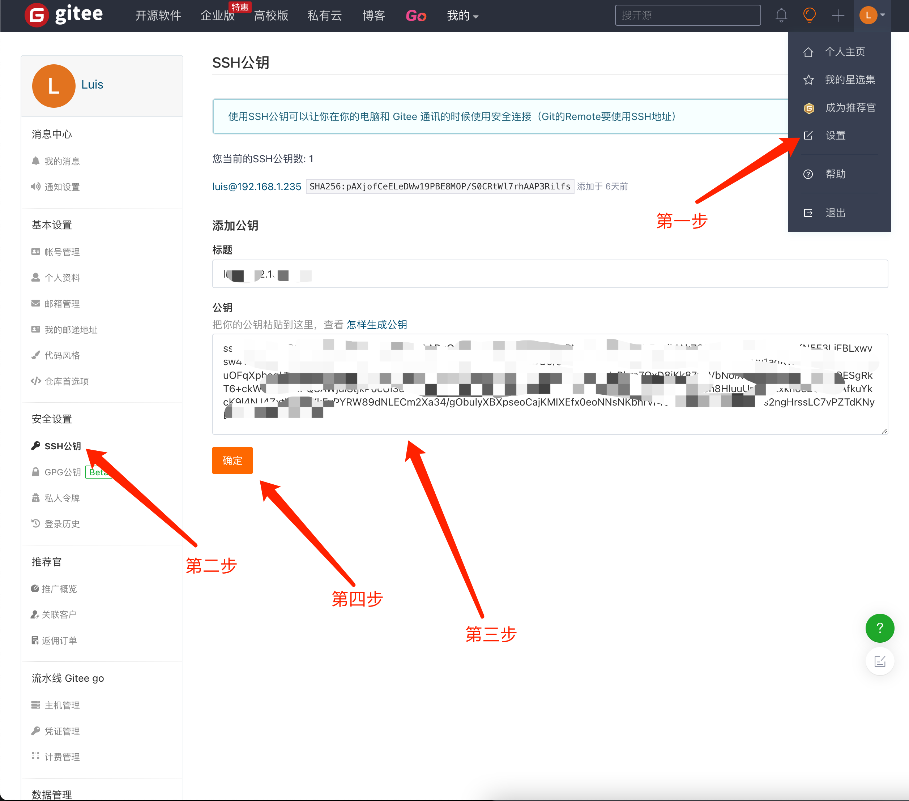

# git 教程

## 目录

## 名词概念

### 📝 workspace 工作区

需要提交文件的根目录, 也就是工程文件所在的目录,除了 .git 目录, 因为 .git 目录是git 的配置文件目录

就像你的草稿纸或文档编辑器（比如 Word），你在上面写字、修改内容，但这些改动只是暂时的，还没有正式保存。

### 📌 staging area 暂存区

提交到仓库之前的再存区域。当你觉得文件已经编辑完成要提交老师了，要把完成的文件暂时存放在一个区域。这个区域就是暂存区。此时文件的状态被跟踪状态, 被跟踪的文件已经被作为单独的副本保存在暂存区, 如果工作区的文件被修改,暂存区的文件并不会受到影响, 

### 📂 local repository 本地仓库

你觉得文件已经有一定的完成度了，于是正式存档在自己的专门的区域，也就是准备正式将文件保存到专门存放已完成文件的区域。就像你整个文件/文件夹备份了一份，确保不会丢失。

### ☁️r emote repository 远程仓库

相当于将已完成的文件上传到网盘，以便分享和备份

**总结**：

 - 工作区 = 你正在编辑的文件
 - 暂存区 = 你选出来准备提交的文件
 - 本地仓库 = 你誊写并存档的最终版本
 - 远程仓库 = 你上传到云端共享的版本

## 初始化配置

### git config 配置工具

用户设置和一些额外配置

| 选项                | 说明                                                                                                |
|---------------------|-----------------------------------------------------------------------------------------------------|
| `--global`          | 代表用户的全局设置,设置只对当前用户生效,配置文件位于 `~/.gitconfig`)                                |
| `--system`          | 代表系统级设置,设置对所有用户生效,配置文件位于`/etc/gitconfig`                                        |
| `--local`           | 代表仓库设置,配置文件位于 `当前仓库/.git/config`                                                    |
| `-l`(`--list`)      | 查看配置文件内容, 用户配置+项目配置+系统配置的总览                                                  |
| `-e`(`--edit`)      | 单独的 `-e` 参数表示编辑当前项目配置文件,等同于 `-e --local`,相当于编辑 `当前仓库/.git/config` 文件 |
| `-e --global`       | 编辑用户配置文件,相当于编辑 `~/.gitconfig` 文件                                                     |
| `-e --system`       | 编辑系统配置文件, 相当于编辑`/etc/gitconfig` 文件                                                   |
| =================== | ==                                                                                                  |

**设置用户名:**

``` shell
git config --global user.name "Luis"
```

**设置用户邮箱:**

```shell
git config --global user.email "xxxxxxxxx@xx.com"
```

**设置默认编辑器:**

git 默认编辑器是 vim, 如不喜欢可以改成其他编辑器! 这里用的是 nvim

```shell
git config --global core.editor nvim
```

**高亮显示:** 

``` sh
git config --global color.ui true
```

**免密码推送/拉去：** 

```sh
git config --global credential.helper store
```

**查看用户设置:**

```sh
# 查看用户名
git config user.name

# 查看用户邮箱
git config user.email

# 查看默认编辑器
git config core.editor
```
**重置用户配置:** 

``` sh
# 取消用户名
git config --unset --global user.name

# 取消用户邮箱
git config --unset --global user.email

# 取消默认编辑器
git config --unset --global core.editor
```

 如以上代码所示,重置用户名或邮箱的前提是先取消用户名, 然后在重新设置用户名

**列出配置信息总览:**

``` sh
git config --list

# 可简写成 git config -l
```

**编辑用户配置文件:**

``` sh
git config --global --edit 
```

---

### git init 初始化仓库

在指定目录下初始化一个空的 git 本地仓库, 指定的 目录下会自动生成 .git 隐藏文件夹，里面包含了所有 git 的元数据. 该隐藏文件夹就是 git 版本库, 可以理解把指定的目录转换成了本地仓库, 

| 选项                   | 说明                                                                                                                                                                                                                                                                                                                                                                                                                                                                                                                                                                                           |
|------------------------|------------------------------------------------------------------------------------------------------------------------------------------------------------------------------------------------------------------------------------------------------------------------------------------------------------------------------------------------------------------------------------------------------------------------------------------------------------------------------------------------------------------------------------------------------------------------------------------------|
| `--initial-branch=`    | 指定分支名                                                                                                                                                                                                                                                                                                                                                                                                                                                                                                                                                                                     |
| `--bare`               | 创建裸仓库git init 初始化的仓库，目录下只有一个 .git 隐藏文件夹，里面包含各种信息，而 git init --bare 表示创建一个裸库，主要应用场景是作为公共仓库。裸库的目录下没有隐藏 .git 目录，全都是显示的，没有 .git 这个目录，进入文件直接是文件内容，一般来讲，作为远端备份或公共版本库时，应该使用 git init --bare。git init –bare 方法创建一个所谓的裸仓库，之所以叫裸仓库是因为这个仓库只保存 git 历史提交的版本信息，而不允许用户在上面进行各种 git 操作，如果你硬要操作的话，只会得到下面的错误（”This operation must be run in a work tree”）。这个就是最好把远端仓库初始化成 bare 仓库的原因。 |
| ====================== | =======                                                                                                                                                                                                                                                                                                                                                                                                                                                                                                                                                                                        |

``` sh
git init [dir]
```

若已经在该目录下,直接输入 `git init` 即可


---
<br/>

### git clone 克隆远程仓库

将远程仓库里的代码拷贝到本地目录

| 选项        | 说明               |
|-------------|--------------------|
| `--depth 1` | 只克隆当前版本文件 |
| `--`        |                    |

``` sh
git clone [url]
```

**克隆到指定目录:**

若没有指定目录, git 会自动创建

``` sh
git clone [url] [dir]
```

---

## 增删改

### git add 添加到暂存区

``` sh
git add [files]
```

**添加所有文件:** 

可用 `git add .` 将所有文件添加到暂存区

| 选项 | 说明                     |
|------|--------------------------|
| `.`  | 表示当前目录下的所有文件 |

**删除暂存区文件:**

``` sh
git rm --cached [filename]
```

| 选项       | 说明                               |
|------------|------------------------------------|
| `--cached` | 表示暂存区 ,仅删除暂存区跟踪的文件 |
| `-f`       | 强制删除                           |
| `-r`       | 递归删除目录和目录内的文件         |

---

### git commit 上传本地仓库

将暂存区文件提交到本地仓库

``` sh
git commit -m "第一次提交"
```
---

**选项:** 

| 选项 | 说明                           |
|------|--------------------------------|
| `-m` | m 为 message. 添加提交信息说明 |

### git status 查看仓库状态

**查看文件状态:** 

```
git status
```

**输出以下结果:**

``` sh
On branch master
Changes to be committed:
  (use "git restore --staged <file>..." to unstage)
        new file:   1.c

Changes not staged for commit:
  (use "git add <file>..." to update what will be committed)
  (use "git restore <file>..." to discard changes in working directory)
	modified:   2.c

Untracked files:
  (use "git add <file>..." to include in what will be committed)
	3.c

no changes added to commit (use "git add" and/or "git commit -a")
```

**包含的状态:**
1. changes to be committed: 待提交的文件(在暂存区未提交到本地仓库)
2. changes not staged for commit: 已修改的文件
	- modified: 已修改的文件
3. untracked files: 没有添加到暂存区的新的文件(未跟踪文件)
4. On branch master: 在 master 分支里
5. No commits yet: 暂存区里没有未提交库的文件
6. nothing to commit: 没有任何文件需要提交

---

### git mv 重命名/移动文件

注: 重命名和移动文件之后的状态, 都会保存在暂存区.而不是直接对仓库里的文件进行操作. 重命名或移动文件之后要提交到仓库!!!


**重命名文件:** 

```
git mv [路劲/文件名] [新路径/文件名]
```


**移动文件:** 

``` sh
git mv [文件名] [新文件名]
```
---

### git diff 对比仓库和工作区文件

``` sh
git diff [filename]
```

**输出结果:** 

``` sh
diff --git a/test.txt b/test.txt
index 8bda4cb..3488c68 100644
--- a/test.txt
+++ b/test.txt
@@ -1,4 +1,5 @@
-this is test word
+this is test word hello
+h
 this is test word
 this is test word
 this is test word
```

以上输出结果中, 前面有 `+` 号的代表新增的内容. 前面有 `-` 号的代表去除的内容. 若对其中一行进行修改,输出结果为新增一行,减去一行.

如果修改的文件被跟踪, 再对工作区进行修改, 那么 `git diff ....` 只对比工作区和暂存区的文件.

如果文件在暂存区, 工作区被修改的文件只能和暂存区的文件进行对比, 若文件被提交仓库, 则工作区文件只能和仓库文件进行对比

要对比暂存区和本地库的文件, 要加一个 `--staged` 参数

``` sh
git diff --staged [filename]
```

---


### git reset 版本回退

| 选项      | 说明                                             |
|-----------|--------------------------------------------------|
| `--soft`  | 移动指针到指定版本号, 不更改工作区和暂存区内容   |
| `--mixed` | 默认值,移动指针到指定版本号, 暂存区内容会更改    |
| `--hard`  | 移动指针到指定版本号, 暂存区和工作区内容会被更改 |

**查看历史版本:**

``` sh
git reflog
```

**更改到指定版本:**

``` sh
git reset --hard [版本号] 
```

### 排除文件

让特定文件/目录不被提交仓库

在工作区新建 `.gitignore` 的文件

``` sh
*.txt   # 忽略以 .txt 为结尾的文件
!lib.txt # 但lib.txt 文件除外
dir1/ # 忽略 dir 目录及目录下的所有文件
/dir2 # 忽略除 dir2 目录以外的所有文件

```

---

## 日志管理

### git reflog 查看短日志

``` sh
git reflog
```

输出以下结果:

``` sh
daacfa1 (HEAD -> master, origin/master, origin/HEAD) HEAD@{0}: commit: git note
```

`git reflog` 只输出 版本号,所在分支和提交信息

---

### git log 查看查看详细日志

查看提交的账户信息,备注和提交时间

``` sh
git log
```

**输出以下结果:**

``` sh
commit e151e9ed9290b8ad32aecb8ccd4bc5b6573a4f1b (HEAD -> master, origin/master, origin/HEAD)
Author: Luis <1014150883@qq.con>
Date:   Mon Dec 12 02:52:26 2022 +0800

    第一次提交
```
1. commit: 提交的版本号和指向的分支
1. Author: 提交的账户和邮箱
2. Date: 用户的提交日期和时间
3. 最底下的是提交的备注

---

## 分支管理

### git branch 创建/查看分支

| 选项 | 说明                                      |
|------|-------------------------------------------|
| `-v` | 查看分支,可以查看每一个分支的最后一次提交的信息 |

**查看现有分支：** 

```sh
git branch

# 输出结果：

```

**查看各分支最后一次提交的信息:**

```sh
git branch -v

# 输出如果:

```

### git checkout 分支切换

### git merge 分支合并

---

## 远程操作

### git remote

管理 Git 仓库中的远程仓库

| 选项      | 说明                                 |
|-----------|--------------------------------------|
| `-v`      | 显示出远程仓库                       |
| `add`     | 添加新的远程库, 添加远程库的 URL     |
| `rename`  | 重命名远程库                         |
| `remove`  | 删除远程库                           |
| `set-url` | 修改远程库的 URL                     |
| `show`    | 显示远程库详细信息,如 URL 和跟踪分支 |


```sh
# 显示远程库名称:
git remote

# 显示远程库名称和 URL:
git remote -v

# 添加远程库名称和 URL:
git remote add [remote name] [url]

# 重命名远程库:
git remote rename [old name] [new name] 

# 从 本地仓库移除远程库:
git rename remove [remote name]

# 修改远程仓库的 url
git remote set-url [remote name] [URL]

# 显示远程库详细信息:
git remote show [remote name]
```

---
<br/>

### push

将本地库推送至远程库

| 选项 | 说明 |
|------|------|
| `-u` |      |

---
<br/>

## 免密登录

1. 获取系统ssh秘钥:

``` sh
ssh-keygen
```

2. 这样在 ~/.ssh/ 目录下会生成 id_rsa 和 id_rsa.pub 两个文件



3. 将 ~/.ssh/id_rsa.pub 里的内容全选复制



4. 打开 gitee, 点击头像下拉菜单里的账户设置, 左边菜单选择 ssh公钥, 把刚刚复制的id_rsa.pub里的内容粘贴到公钥文本框内.单击确定按钮



